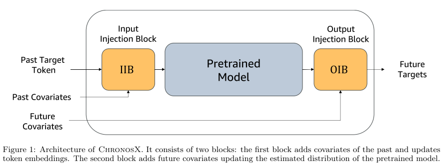
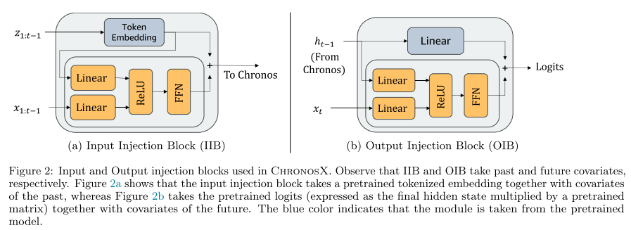
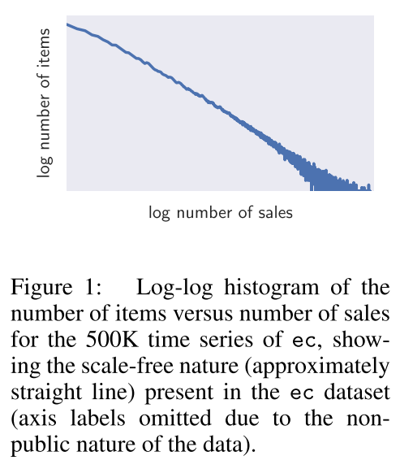
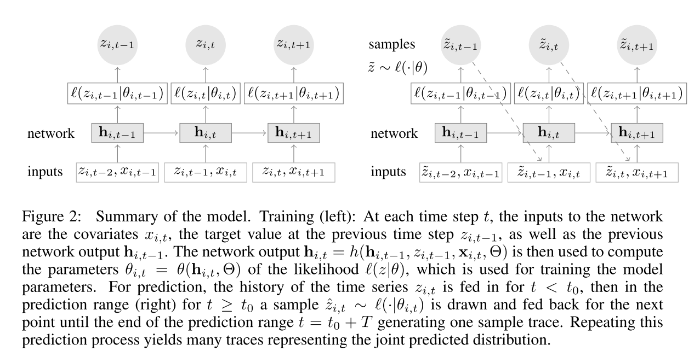

# Forecasting with covariates

## Paper1 ChronosX: Adapting Pretrained Time Series Models with Exogenous Variables

#### Motivation

在实际的时间序列预测任务中，协变量（如节假日、天气、促销活动等）对预测结果影响巨大，能提供关键的上下文信息。

当前很多强大的预训练时间序列模型（例如 Chronos、TimesFM、MOMENT 等）在大规模无协变量的语料上训练，原生并不支持协变量输入，或者支持有限。

因此需要设计轻量、模块化的适配器结构，将过去和未来的协变量信息注入到这些冻结的预训练模型中，既保持预训练知识，又提升在协变量丰富任务上的下游性能。

#### Method

提出了ChronosX方法，通过在预训练模型中插入两种模块来处理外生变量：一是输入注入模块（IIB），将过去时刻的协变量与对应的Token嵌入分别经过线性映射后在ReLU激活和全连接网络（FFN）中融合，更新Token嵌入；二是输出注入模块（OIB），将未来时刻的协变量与模型最后隐藏状态分别映射后在ReLU和FFN中融合，生成对原始logits的调整项，两者相加后输出，从而在不改动预训练权重的情况下同时利用过去和未来的外生信息提升预测性能

## Paper2 DeepAR: Probabilistic Forecasting with Autoregressive Recurrent Networks

#### Motivation

在处理现实世界中多个时间序列进行联合建模时, 各个时间序列的量级差异非常大，且这些量级的分布呈现强烈的偏态（skewed）

作者以亚马逊的商品销售数据为例，说明每个商品的销售速度（例如：每周平均销量）可以相差好几个数量级，整体呈现幂律分布（也就是“长尾分布”：大部分商品卖得很少，少数商品卖得很多）。

这种数据分布带来了几个建模上的挑战：

i) 不能简单地将时间序列划分为几个“量级段”再单独建模：
例如，试图只建模“高销量商品”或“低销量商品”各自的模型，是不可行的。原因是每个小组内部仍然存在严重的偏态分布。

ii) 基于分组的正则化策略也会失效：
比如 Chapados 提出的按组正则化方法假设组内数据分布是相对均匀的，但这里即便同组内的商品，它们的销量也可能差异极大，破坏了方法的基本假设。

iii) 标准化技术失效：
像输入标准化（input standardization）或批标准化（batch normalization）这样的预处理手段通常假设数据是近似正态分布的，但面对极度偏态、尺度悬殊的数据时，这些方法的效果会大打折扣。

#### Method

在处理外生变量上，也就是当作普通输入特征来直接拼接到LSTM的每一步中

