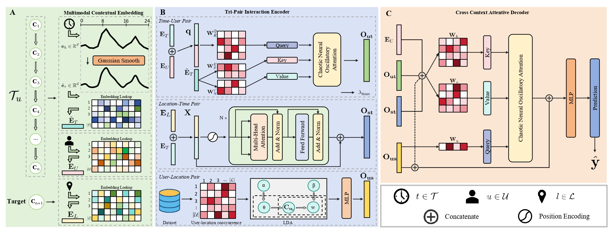

# Beyond Regularity: Modeling Chaotic Mobility Patterns for Next Location Prediction 🧠

CANOE is a novel model designed to predict a user's next destination by effectively balancing their periodic and chaotic movement patterns, while also leveraging contextual information for improved accuracy.


## Introduction 🌟

The analysis of human mobility is a pivotal task with broad applications, from optimizing urban resources to providing personalized navigation. A significant challenge in this field is accurately predicting a user's next location, a task complicated by the dual nature of human movement: it is both periodic (e.g., daily commutes) and chaotic (e.g., spontaneous trips). 

To address these limitations, Our project introduces an novel model that integrates a biologically inspired chaotic attention mechanism to better balance chaotic and periodic mobile pattern.


## Key Modules ✨

- 🌐 Multimodal Contextual Embedding Module: Aiming at transforming heterogeneous ``who-when-where'' contexts into unified vector representations
- 📝 Tri-Pair Interaction Encoder: To capture pairwise relationships among user, time, and location modalities
- 🔄 Cross Context Attentive Decoder: Integrating the features of pairwise interaction by aligning ``who-when-where'' dependencies

## Framework 🏗️

<div align="center">
  
  <br>
  <em>Illustration of the CANOE framework.</em>
</div>

## Results 📊

Empirical experiments conducted on two real-world datasets demonstrate superior performance compared to existing SOTA baselines.

## Main Experimental Results

| Method                | \multicolumn{5}{c|}{\textbf{traffic camera}}                                   | \multicolumn{5}{c|}{\textbf{mobile phone}}                                     |
| :-------------------- | :-----: | :-----: | :-----: | :-----: | :-----: | :-----: | :-----: | :-----: | :-----: | :-----: |
|                       | Acc@1   | Acc@3   | Acc@5   | Acc@10  | MRR     | Acc@1   | Acc@3   | Acc@5   | Acc@10  | MRR     |
| **1-MMC** | 23.61   | 39.50   | 44.43   | 48.29   | 32.42   | 29.48   | 45.68   | 49.54   | 52.46   | 38.21   |
| **Graph-Flashback** | 35.69 (0.03) | 55.64 (0.08) | 63.73 (0.05) | 72.25 (0.05) | 48.18 (0.03) | 37.61 (0.03) | 59.62 (0.02) | 65.86 (0.02) | 71.88 (0.03) | 50.31 (0.02) |
| **SNPM** | 36.43 (0.05) | 56.18 (0.02) | 63.74 (0.04) | 71.45 (0.02) | 48.58 (0.01) | 37.99 (0.07) | 59.89 (0.02) | 66.03 (0.04) | 71.92 (0.01) | 50.60 (0.04) |
| **DeepMove** | 35.89 (0.07) | 51.60 (0.07) | 57.72 (0.07) | 65.15 (0.04) | 46.08 (0.05) | 37.38 (0.04) | 56.84 (0.03) | 63.10 (0.02) | 69.88 (0.03) | 49.11 (0.02) |
| **Flashback** | 34.89 (0.06) | 54.92 (0.09) | 62.88 (0.04) | 71.00 (0.07) | 47.33 (0.04) | 37.39 (0.03) | 59.64 (0.05) | 65.96 (0.04) | 72.01 (0.06) | 50.22 (0.02) |
| **STAN** | 29.92 (0.10) | 49.70 (0.12) | 57.81 (0.08) | 66.24 (0.10) | 42.39 (0.08) | 36.40 (0.09) | 56.43 (0.10) | 62.15 (0.12) | 67.77 (0.12) | 48.06 (0.09) |
| **GETNext** | 35.53 (0.11) | 54.26 (0.14) | 61.27 (0.21) | 68.64 (0.12) | 47.15 (0.11) | 36.93 (0.09) | 59.44 (0.11) | 65.75 (0.40) | 71.80 (0.64) | 49.89 (0.09) |
| **Trans-Aux** | 36.69 (0.12) | 53.97 (0.13) | 60.38 (0.11) | 67.50 (0.07) | 47.52 (0.09) | 38.52 (0.31) | 56.66 (0.11) | 61.76 (0.18) | 67.28 (0.18) | 49.24 (0.12) |
| **CSLSL** | 36.96 (0.12) | 55.02 (0.13) | 61.67 (0.11) | 68.79 (0.07) | 48.17 (0.09) | 37.86 (0.16) | 60.22 (0.07) | 66.52 (0.02) | 71.94 (0.01) | 50.51 (0.11) |
| **MCLP-LSTM** | 39.90 (0.06) | 58.32 (0.07) | 65.14 (0.07) | 72.43 (0.07) | 51.28 (0.05) | 39.42 (0.16) | 60.74 (0.07) | 66.95 (0.06) | 72.98 (0.06) | 51.81 (0.08) |
| **MCLP-Attention** | 40.11 (0.05) | 58.44 (0.05) | 65.30 (0.04) | 72.58 (0.05) | 51.46 (0.02) | 39.65 (0.02) | 61.02 (0.05) | 67.18 (0.06) | 73.15 (0.05) | 52.04 (0.03) |
| **CANOE** | **45.37 (0.09)** | **64.43 (0.18)** | **71.03 (0.15)** | **77.78 (0.16)** | **56.86 (0.12)** | **40.92 (0.01)** | **63.04 (0.12)** | **69.41 (0.07)** | **75.49 (0.07)** | **53.69 (0.04)** |
| **Improvement (%)** | 13.11   | 10.25   | 8.78    | 7.16    | 10.49   | 3.20    | 3.30    | 3.32    | 3.20    | 3.17    |

## Getting Started 🚀

1. Clone the repository:
```bash
git clone https://github.com/yuqian2003/CANOE.git
cd CANOE
```

2. Install dependencies:
```bash
conda env create -f create_env.yml
conda activate canoe
```

3. Model Training
Run the experiments in Traffic Camera:
```bash
bash run_tc.sh
```
Run the experiments in Mobile Phone dataset:
```bash
bash run_mp.sh
```


## Citation 📚

If you use this code in your research, please cite our work:

```bibtex
@article{xxx,
  title={Beyond Regularity: Modeling Chaotic Mobility Patterns for Next Location Prediction},
  author={Wu, Yuqian and Peng, Yuhong and Yu, Jiapeng and Liu, Xiangyu and Yan, Zeting and Lin, Kang and Su, Weifeng and Qu, Bingqing and Raymond S.T. Lee and Yang, Dingqi },
  journal={xxxxxxxxxx},
  year={2025}
}
```

## License 📄

This project is licensed under the MIT License. See LICENSE for details.
